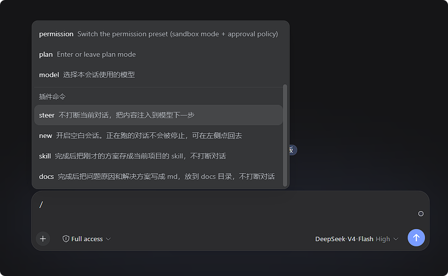
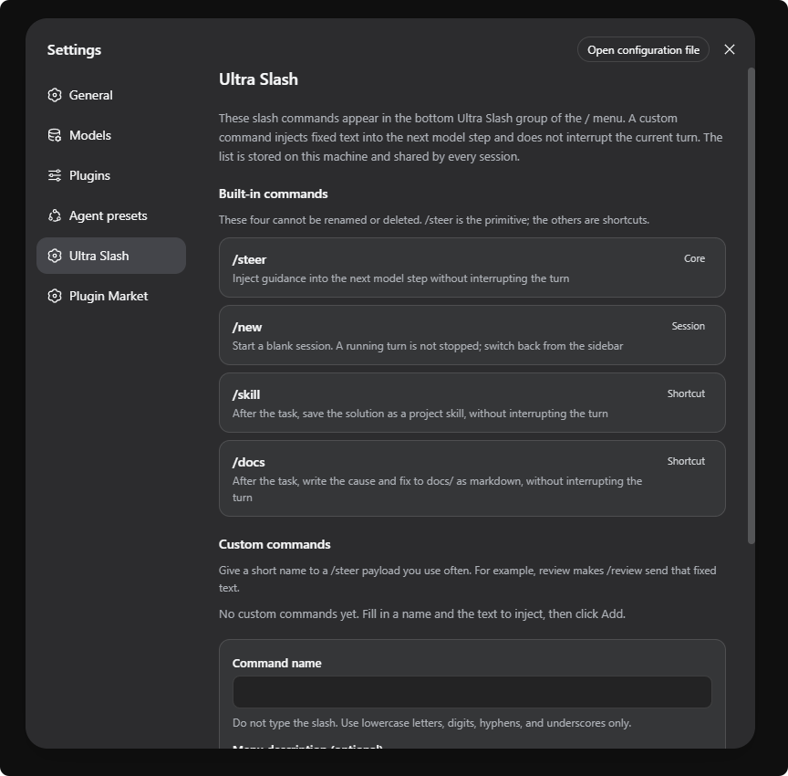

# deepseek-harness-ultra-slash

[English](README.en.md) | [中文](README.md)

**Ultra Slash** for DeepSeek Harness: a separate `/` menu group for this plugin's commands.




## Features

| Command | What it does |
| --- | --- |
| `/steer text` | Injects text on the agent's **next model step**; does not interrupt the current turn |
| `/new` | Starts a blank session |
| `/skill` | `/steer` + “save the solution as a project skill when done” |
| `/docs` | `/steer` + “write the cause and fix to docs/ as markdown when done” |

Custom `/name` aliases of `/steer` can be added under **Settings → Ultra Slash**.

## Install

Requires [DeepSeek Harness](https://github.com/deepseek-ai/deepseek-harness) with `dsh web` available.

### From npm

```sh
dsh plugin --profile web add deepseek-harness-ultra-slash@0.2.0
```

Do not omit `@0.2.0`: pnpm protects freshly published versions for 24 hours, and a bare install may pick an older release.

### From GitHub

```sh
dsh plugin --profile web add github:loadingvx/deepseeh-harness-ultra-slash
```

## License

MIT
